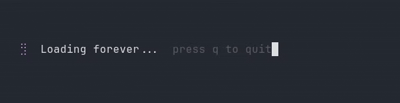
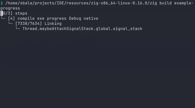
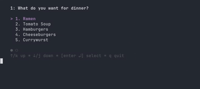

<!-- SPDX-License-Identifier: MIT -->

<div align="center">


</div>

[](https://ziglang.org)
[](https://github.com/rockorager/libvaxis)

[](LICENSE)


<!--  -->
> Grow terminal interfaces from the ground up.

---

<table>
<tr>
<td width="180" valign="top">

</td>
<td valign="top">
(feno: ) I promise not to yap or bore you. 
Keep it family-friendly in the issues, or I will haunt your nightmares. Have a leafy day!
</td>
</tr>
</table>

## • What is fern?
fern is a TUI framework written in Zig. It is not here to hold your hand. May hold a bit, no pinky promish from myside btw...

It follows the `Elm Architecture` — every frame is a pure function of state, every side-effect is a value you return, and the runtime does exactly what you tell it. init, update, view. That's the whole contract. No magic, no hidden threads you didn't ask for — well, four threads, but you asked for them when you called run().

Under the hood, fern is six composable libraries that happen to fit together:

- fern_ansi — parses every byte the terminal throws at you
- fern_style — a chainable style builder with proper inherit() semantics
- fern_zone — tracks where your components actually landed on screen (yes, for mouse hit-testing)
- fern_anim — damped springs and projectile physics, because why not
- fern_widget — spinner, progress, viewport, text input, and friends
- fern_app — the runtime: raw mode, 60 fps event loop, SIGWINCH, the works

The `Cmd type` is how you talk to the runtime. You don't do things — you describe them. .task runs your function on a worker thread. .every ticks a timer. .after delays a message. .batch fires them all. .quit is mercifully self-explanatory.

No GC. No hidden allocations. No runtime you can't read in an afternoon.
The diff renderer — affectionately named the cursed renderer internally — does line-level diffing at 60 fps and only repaints what changed. The zone manager uses private-use CSI escape sequences (ESC [ Nz) as invisible coordinate markers embedded in your render output. It sounds cursed. It works beautifully, If god likes it...

fern targets DO-178C compliance. That's the aerospace safety standard. For a terminal UI framework. Yes, really. Because if you're going to build something, you might as well build it like lives depend on it....just kidding...

## • Features

- **Comptime layouts.** Your widget tree is resolved at compile time where possible.
  The runtime doesn't think. It executes. Fast...or...if you are out of luck....well thats not my fault..

- **Proper focus management.** Tab, shift-tab, arrow keys — fern_widget handles the
  full focus ring so you don't have to manually track "which thing is selected" in
  your state like an animal.

- **Mouse support, out of the box.** Click, scroll, hover — fern_zone maps every
  event to the exact widget that owns that cell. No coordinate math on your end.

- **Spinner, progress bar, viewport, text input — included.**
  Not as an afterthought. Not as a separate crate you have to hunt for.
  Just there, in fern_widget, waiting.

- **Style inheritance that actually works.** Set a color on a parent.
  Children inherit it. Override in a child. Only that child changes.
  Sounds obvious. Most TUI frameworks don't do it.

- **One allocator to rule them all.** Pass yours in. fern never touches
  the heap behind your back. Useful when your allocator is a fixed buffer
  and the heap is a distant memory.

## • Quick Start

> **Zig 0.16.0 is required.** Not 0.13. Not 0.14. Not whatever nightly you compiled
> last Tuesday. 0.16.0. We're not your Zig version manager.
> Get it at [ziglang.org/download](https://ziglang.org/download).

```bash
git clone https://github.com/fern-tui/fern-core.git
cd fern-core/
```

That's it. No `npm install`. No `cargo fetch`. No three nested package managers
arguing about semver. Just a directory with Zig in it.

---

### Run the examples

The fastest way to see fern breathe. Pick one:

```bash
# A spinner. Spins. Forever. Press q when you've had enough.
zig build example-spinner

# A progress bar with damped spring animation.
# Goes from 0% to done. Unlike some projects.
zig build example-progress

# A scrollable list with focus management and keyboard nav.
zig build example-list
```

All three live in `examples/` if you want to read the source before trusting it.
Which you should. That's the whole point of no hidden allocations.

---

### Format the source (optional, but appreciated)

```bash
zig fmt src/
zig fmt examples/
zig fmt build.zig
```

We won't merge PRs that skip this. The formatter has no opinions. We trust the formatter.

---

### Run the tests

```bash
zig build test          # everything
zig build test-app      # just the app/ runtime
zig build test-widget   # just the widget layer
```

Tests pass. If they don't on your machine, check your Zig version.
(It's 0.16.0. See above.)

---

### Using fern in your own project

Add fern to your `build.zig.zon`:

```zig
.dependencies = .{
    .fern = .{
        .url = "https://github.com/fern-tui/fern-core/archive/refs/tags/v0.1.5-beta7.tar.gz",
        .hash = "...", // zig fetch will give you this
    },
},
```

Fetch and lock the hash:

```bash
zig fetch --save https://github.com/fern-tui/fern-core/archive/refs/tags/v0.1.5-beta7.tar.gz
```

Then wire it up in your `build.zig`:

```zig
const fern = b.dependency("fern", .{
    .target = target,
    .optimize = optimize,
});

// add only what you need
exe.root_module.addImport("fern_ansi",   fern.module("fern_ansi"));
exe.root_module.addImport("fern_style",  fern.module("fern_style"));
exe.root_module.addImport("fern_app",    fern.module("fern_app"));
exe.root_module.addImport("fern_widget", fern.module("fern_widget"));
```

And in your source:

```zig
const ansi   = @import("fern_ansi");
const style  = @import("fern_style");
const app    = @import("fern_app");
const widget = @import("fern_widget");
```

Look at `examples/01_spinner/main.zig` for the full init/update/view pattern.
That's the whole model. There's no secret fourth thing.

---

## • Architecture

fern is not one thing. It's six libraries that happen to fit together.
You can use `fern_ansi` standalone. You can skip `fern_chart` entirely.
Nothing reaches up the stack. No circular deps. Ever.

```
Your App
    │
    │  init()  update()  view()
    ▼
┌─────────────────────────────────────────────────────┐
│                    fern_app                         │
│   60fps event loop · raw mode · diff renderer       │
│   SIGWINCH · 4 worker threads · Cmd/Msg dispatch    │
└────────────┬────────────────────────────────────────┘
             │ uses
    ┌────────┴───────────────────────────────┐
    │                                        │
    ▼                                        ▼
┌──────────────────┐             ┌──────────────────────┐
│   fern_widget    │             │     fern_chart (!)   │
│  spinner         │             │  bar  · line         │
│  progress        │             │  stream · heatmap    │
│  textinput       │             │  timeseries · wave   │
│  viewport        │             │                      │
│  table · list    │             │  (braille canvas,    │
│  paginator · ... │             │   not string-based)  │
└──┬───┬───┬───────┘             └──┬───────────────────┘
   │   │   │                        │
   │   │   └──────────┐             │
   ▼   ▼              ▼             ▼
┌───────────┐  ┌──────────┐  ┌────────────┐
│fern_style │  │fern_anim │  │fern_zone   │
│ Style     │  │ Spring   │  │ ZoneManager│
│ Border    │  │ Throw    │  │ hit-test   │
│ Layout    │  │ (physics)│  │ mouse      │
└─────┬─────┘  └──────────┘  └────┬───────┘
      │                           │
      └──────────┬────────────────┘
                 ▼
         ┌──────────────┐
         │  fern_ansi   │
         │ color · csi  │
         │ parse · width│
         │ str · osc    │
         └──────────────┘
              │
              ▼
           std only
         (no libc, no deps)
```

**Dependency rules — enforced, not aspirational:**

| Module | Depends on |
|---|---|
| `fern_ansi` | nothing — `std` only |
| `fern_anim` | nothing — `std.math` only |
| `fern_style` | `fern_ansi` |
| `fern_zone` | `fern_ansi` |
| `fern_app` | `fern_ansi` |
| `fern_widget` | `fern_style`, `fern_anim`, `fern_zone`, `fern_app` |
| `fern_chart` (Not added yet!) | `fern_style`, `fern_zone`, `fern_app` |

Nothing goes sideways. Nothing goes up. If you see a PR that adds an import
that breaks this table, reject it. That's the whole architecture review.

---

<table>
<tr>
<td valign="top">
(feno: ) now might be thinking.... how to use it any examples... 
look bellow pretty boyy !!
</td>
<td width="240" valign="top">

</td>
</tr>
</table>

## Examples

Three included examples. Each one is a single file in `examples/`.
Read the source. It's the best documentation.

### 01 — Spinner




A spinner that ticks at 60fps using the Elm tick-routing pattern.
Every spinner has a unique ID so you can run ten of them without
them stealing each other's ticks.

```bash
zig build example-spinner
```

```zig
// The whole model in ~10 lines
const Msg = union(enum) {
    key:          ansi.KeyEvent,
    spinner_tick: widget.spinner.TickMsg,
};

const State = struct {
    spinner:  widget.Spinner,
    quitting: bool = false,
};

// init: create spinner, fire first tick
var sp = widget.Spinner.initPreset(widget.spinner.DOT);
sp.setStyle(SPIN_STYLE);
return .{ .{ .spinner = sp }, sp.tick(Msg) };

// update: route tick back to spinner, quit on q
.spinner_tick => |t| {
    const r = state.spinner.update(t, Msg);
    state.spinner = r.s;
    return r.cmd;  // keeps the tick loop alive
},
```

---

### 02 — Progress Bar




Spring-animated fill. Not a linear lerp. An actual damped harmonic oscillator
(`ang_freq=18, damping=1.0`) so the bar eases into position like it has weight.
Increments 25% every second. RGB gradient across the fill. Centers itself in
whatever terminal size you give it.

```bash
zig build example-progress
```

```zig
// Bump the bar — spring does the rest
.tick => {
    const anim_cmd = state.progress.incrPercent(0.25, Msg);
    // batch: keep the 1s tick going + drive the animation frames
    return app.batch(Msg, &.{ tickCmd(), anim_cmd });
},
```

---

### 03 — Simple List




Paginated list, dot indicator, j/k + arrow navigation, enter to select.
On selection: transitions to a done screen. No extra dependencies.
The paginator is `fern_widget.Paginator` — four fields, two display modes.

```bash
zig build example-list
```

```zig
// Page tracking is two lines
state.pag.page = state.cursor / PAGE_SIZE;

// Done screen is one line
"Cheeseburgers? Sounds good to me."
```

---

<table>
<tr>
<td width="180" valign="top">

</td>
<td valign="top">

(feno: ) yes yes I know.... CONTRIBUTING.md doesn't exist yet.
it's on the roadmap. the roadmap also doesn't exist yet. we're working on it.

</td>
</tr>
</table>

## Contributing

PRs welcome. The bar is: it compiles, tests pass, and the dep table above stays intact.

```bash
zig build test       # run this before opening a PR
zig fmt src/         # and this
zig fmt examples/
zig fmt build.zig
```

See [CONTRIBUTING.md](CONTRIBUTING.md) for the full picture — coding style,
commit format, how to add a new widget, and what "DO-178C targeting" means
for code review. If `CONTRIBUTING.md` doesn't exist yet when you're reading this,
open an issue. That's also contributing.

---
<div align="center"><sub>built with Zig 0.16.0 • fern core+ • MIT</sub></div>